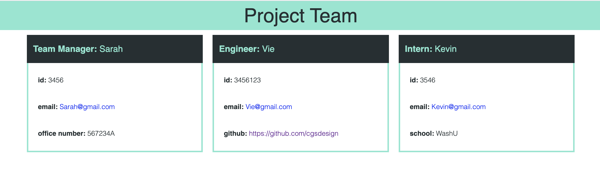

# Team Profile Generator - for HR 

## Description 

For this project I worked in JS using Node.js to create a deployment ready HTML file to display drop teams based off of command line inputs. This project utilized Jest testing and  OOP structuring, as well as inquire for prompting user feedback.

## Key Features
* responsive design
* fully command line driven 
* manager, engineer, and intern employee data prompted using inquire
* name, email, id, and job specific data prompted and collected
* appropriate data including emails and URLs linked on generated HTML page
* Jest proofs in case of future changes provided for key objects
* OOP structuring centered on employee data

## Installation
Download files from [this github repo](https://github.com/cgsdesign/TeamProfileGenerator). Then, in your command line, go into the main README-Gen folder and type node index.js. The file will automatically run.

## Usage
To view a walkthough on how to use the app, click below for a video walkthough. 
* [Video Walkthough](https://drive.google.com/file/d/1JJZy2TAIAuv-Q4s3gQm_ytEfFu1IW5ZZ/preview)
### Example image of final output HTML:

## Credits
* Inquirer Copyright (c) 2012 Simon Boudrias
* CSS class structure based on https://cdnjs.cloudflare.com/ajax/libs/font-awesome/5.11.2/css/all.min.css 

## License
* MIT

## <a name="badge">Badges</a>

## <a name="contributing">Contributing Information</a>
* [Contributor Covenant](https://www.contributor-covenant.org/)

## <a name="test">Tests</a>
*  node index.js

## <a name="questions">Questions</a>
### contact me at: 
* github: [https://github.com/cgsdesign](https://github.com/cgsdesign)
* email: [cgsdesignmadison@gmail.com](cgsdesignmadison@gmail.com)
